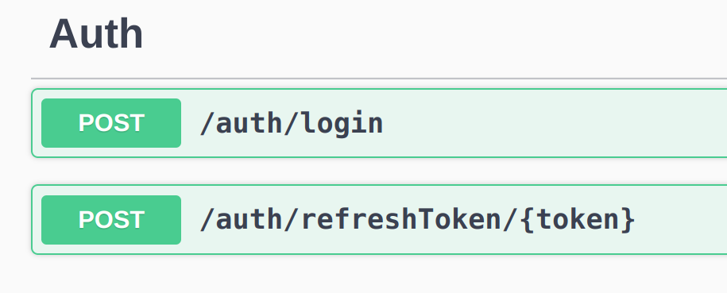
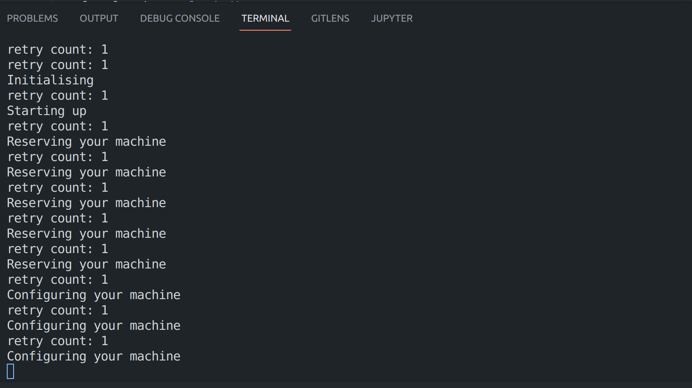
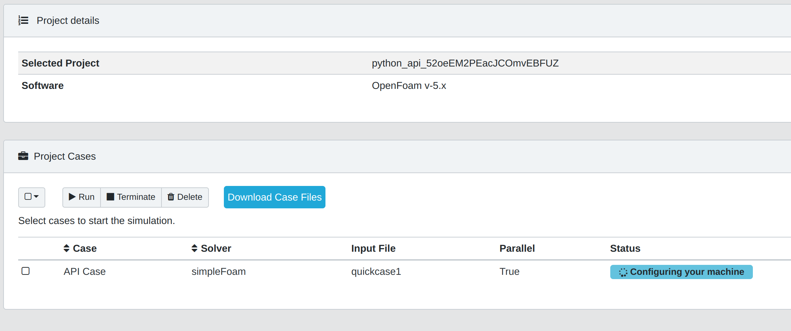

# KaleidoSim API - Python integration example.

This project was created as example of how it is possible to consume all the functionalities provided by KaleidoSim API.

The main language for this example project is Python3.

## Prerequisites

1. Make sure to have python3 installed on your computer.
2. Make sure to have pip installed.
3. Any code editor (we recommend VSCode or PyCharm).
4. An account in [KaleidoSim](https://app.kaleidosim.com/register).
5. A test or multiple test files.

## Setup
1. Make sure you have an account in [KaleidoSim](https://app.kaleidosim.com/register).
2. Add your credentials in the /src/config/config.json, email and password.

```JSON
"user": {
    "email": "your email here",
    "password": "your password here"
  }
```
3. Open a terminal and run the following command to install all the required dependencies:

```bash
pip3 install -r requirements.txt
```

## Project Structure

The project has two main folders: `src` and `test_files`.

The `test_files` folder contains the OpenFoam zip cases that will be used for the simulation.

The `src` folder contains all the python code created for this example.

### **src folder**

Inside the `src` folder there are 5 main folders.

#### **api_request folder**
Inside the api_request folder there are mutliple folders and each one represent or contain one of the sections presented in the KaleidoSim API Explorer.

**For example:**

The Auth section in the Explorer:


Is inside the folder "api_request/auth".

#### **config folder**

The config folder contains only 1 file, this file has three main parameters that must be set up before running any of the examples.

The `config.json` file looks like this:
```JSON
{
  "apiBaseURL": "https://api.kaleidosim.com",
  "user": {
    "email": "",
    "password": ""
  }
}
```
1. The `apiBaseURL` is the KaleidoSim API url, and this application will use that configuration field for every request.
2. User object contains the user credentials.

#### **data folder**
The data folder contains one single file, this file has the configuration required for creating project, cases and uploading files.

For example, the request to create a new project needs the following parameters:
1. the name of the project
2. the version of openfoam
3. the simulation software (OpenFoam)

```python
project_data = {
    "name": "projectName", "version": "5.x", "simulationSoftware": "OpenFoam"
}
```
Every project name has to be unique for an user account, in order to ensure that you can append random generated string to the project name.

Something like this:
```python
from nanoid import generate

name = "My_Project_API_"+generate()
```

#### **http_requests folder**
This folder contains all the different HTTP Request that the application can make to KaleidoSim API.

There is one file that is really important, this file is called: `retry_wrapper`.

The `retry_wrapper` file contains the mechanism to retry a request if this fails because Google was ramping up services.

#### **output folder**
Inside this folder, all the output files generated are downloaded.


## Running example case

Open a terminal and navigate to the src folder.

```bash
cd src/
```

And then execute:
```bash
python3 complete_case.py run_example
```

This command will run a series of steps to setup your simulation and run it in the cloud.


The case created is also visible in the [KaleidoSim Cloud Platform](https://app.kaleidosim.com/)




### complete_case.py script

This file contains a series of http requests to the KaleidoSim API. All these steps are required in order to run a simulation in the Cloud.

Lets analyse the script file.
* First it will login the user and save the token

```python
local_token = login()
UserToken.value = local_token
```

* After that it will create a project.

```python
project_data_req = json.dumps(project_data)
project_id = await create_project(project_data_req)
```

* Upload an input file.
```python
# get signed url for uploading
input_file = await upload_input_file(input_data)

# uploading input file to g storage
upload_file(input_file['data']['resumableUploadUrl'], input_file_path)
```

* Create a case.
```python
case_data_req = json.dumps(case_data)

# creating a case
case_id = await create_case(project_id, case_data_req)
```

* Run the case.

```python
await run(case_id)
```

* Wait until the simulation was completed.

```python
status = current_status['data']['caseStatus']

# waiting case to be completed
while(status != "Completed"):
    time.sleep(5)
    current_status = await get_case_status(case_id)
    status = current_status['data']['caseStatus']
```


* Download results.

```python
await download_case_files(case_id)
```


## Important information

- All the files downloaded are visible in the outputFiles folder
- The token expire after 24 hours
- The token is being replaced for a new one every time ```python3 complete_case.py run_example``` is executed.
- Make sure you have the inputFile in `/test_files/file.zip`
- Make sure the name file is the same as in `/src/data/`
- KaleidoSim API rate limit: 10 request per second.
